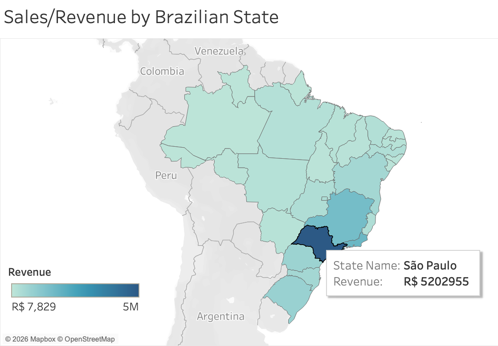
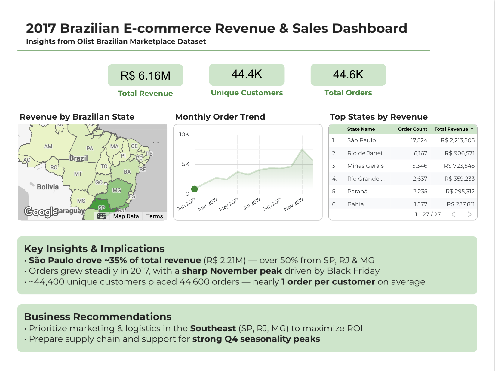

# E-commerce Data Cleaning (Olist)

[](https://opensource.org/licenses/MIT)
[](https://github.com/space-lumps/ecommerce-data-cleaning/actions/workflows/ci.yml)
[](https://www.python.org/)
[](https://github.com/space-lumps/ecommerce-data-cleaning/releases/latest)


## Table of Contents

- [Objective](#objective)
- [Visualizations](#visualizations)
- [Setup](#setup)
- [Dataset Setup](#dataset-setup)
- [Project Structure](#project-structure)
- [Pipeline](#pipeline)
- [Validation & Schema Enforcement](#validation--schema-enforcement)
- [Skills & Key Learnings](#skills--key-learnings)
- [Future Improvements](#future-improvements)
- [API Documentation](#api-documentation)
- [License](#license)

## Objective

Build a reproducible, production-style data cleaning, validation, and ingestion pipeline for the Olist Brazilian e-commerce dataset. Raw CSVs are transformed into clean, schema-enforced Parquet files optimized for BigQuery and downstream analytics.

**Key enhancement (merged from `feature/improve-schema-enforcement` branch):**  
Strengthened deterministic type casting and explicit schema enforcement during Parquet serialization. This gives full control over column types and eliminates common BigQuery import errors caused by weak/ambiguous typing (e.g., `object` → `STRING` coercion failures).

The resulting Parquet files now power reliable analysis and an interactive **Looker Studio dashboard** showing key revenue and order metrics across Brazilian states and product categories.

This project demonstrates modern data engineering and analytics practices:
- Modular `src/` package layout
- Explicit schema contracts and validation
- Automated CI testing + post-ingestion verification
- Reproducible environments via `uv`

---

## Visualizations

### Exploratory Analysis: Revenue by Brazilian State

Early Tableau choropleth map created to validate the cleaned dataset:

<p align="center">
  
</p>

- Shows revenue concentration across states (darker = higher revenue)
- Highlights strong market dominance by São Paulo.
- Built from aggregated `price` and `customer_state`

### 2017 Revenue & Sales Dashboard

Polished interactive dashboard summarizing key findings from the 2017 Olist dataset:



- KPIs: Total Revenue, Unique Customers, Total Orders
- Monthly order trend with seasonality insights
- State-level revenue distribution and top performers
- Key insights and actionable business recommendations

---

## Setup

```bash
git clone https://github.com/space-lumps/ecommerce-data-cleaning.git
cd ecommerce-data-cleaning

uv venv
source .venv/bin/activate    # Windows: .venv\Scripts\activate

uv pip install -e .

# Use sample data (no Kaggle needed)
cp data/samples/*.csv data/raw/
uv run python run_pipeline.py
```

---

## Dataset Setup

The pipeline can run using either the included sample dataset or the full Kaggle dataset.

### Option A — Sample Data (recommended for quick start, no Kaggle needed)

Copy the included samples and run the pipeline:

```bash
cp data/samples/*.csv data/raw/
uv run python run_pipeline.py
```

### Option B - Download full dataset from Kaggle

Download from [Brazilian E-Commerce Public Dataset by Olist](https://www.kaggle.com/datasets/olistbr/brazilian-ecommerce) and place all `.csv` files in `data/raw/`.

Using Kaggle CLI (fastest):

```bash
pip install kaggle
kaggle datasets download -d olistbr/brazilian-ecommerce -p data/raw --unzip
```

Ensure `data/raw/` contains only one version of the data at a time.

---

## Project Structure

```text
ecommerce-data-cleaning/
├── src/ecom_pipeline/          # All reusable code (installable package)
├── data/samples/               # Lightweight test data (included)
├── docs/                       # schema_contract.md, data_dictionary.md, etc.
├── reports/                    # Generated audits and profiles
├── tests/                      # E2E and IO smoke tests
├── .github/workflows/ci.yml
├── pyproject.toml + uv.lock    # Reproducible environment
└── run_pipeline.py
```

The project follows a proper `src/` layout.  
All reusable code lives inside the `ecom_pipeline` package.
Tests live in a top-level `tests/` directory.

---

## Pipeline

### Execution

```bash
uv run python run_pipeline.py
```

### Pipeline Stages

1. **Sanity Check Raw**
  Confirms raw files exist and are readable.
2. **Profile Raw**
  Profiles source datasets before transformation.
3. **Standardize Columns**
  Applies consistent column naming.
4. **Enforce Schema**
  Applies explicit casting rules (including strict `datetime64[ns]` and nullable dtypes) to produce clean Parquet outputs.
5. **Validate Clean Schema**
  Verifies data types match expectations.
6. **Audit Dtypes**
  Flags suspicious type patterns using heuristics.
7. **Validate Schema Contract**
  Enforces required columns, primary key uniqueness, and logical dtype guarantees.
8. **Generate Data Dictionary**  
  Generates `docs/data_dictionary.md` from `reports/clean_dtypes_full.csv`.

---

## Validation & Schema Enforcement

This branch significantly strengthened type safety and Parquet reliability for BigQuery:

**Key Improvements**
- Brazilian CEP (`*_zip_code_prefix`) columns preserved as 5-digit strings with leading zeros for accurate geolocation joins
- Added full English state names (`customer_state_name`) to improve geographic matching in Tableau and Looker Studio (prevents incorrect worldwide matches)
- Enforced modern nullable dtypes (`Int64`, `Float64`, `string`)
- Strict `datetime64[ns]` handling to ensure correct `TIMESTAMP` types in BigQuery
- Improved `dtype_family` logic and data dictionary generation based on cleaned data

These changes eliminate common import failures and produce cleaner, more reliable outputs for analysis and visualization.

### Outputs
- `data/clean/*.parquet` – production-ready files with correct nullable types
- `docs/data_dictionary.md` – living, accurate documentation of the final schema
- `reports/clean_dtypes_full.csv` – detailed audit with null counts/percentages
- `reports/clean_schema_audit.csv` – pass/fail validation of expected types

---

## Skills & Key Learnings

- Modular Python package with proper `src/` layout for maintainability
- Strict schema enforcement and deterministic type casting for reliable Parquet outputs
- Defensive validation (`validate_schema_contract.py`) + CI testing
- Reproducible environments with `uv`
- Production-ready data pipeline powering a Looker Studio dashboard

**Key Learnings**
- Explicit type casting early prevents BigQuery import failures and silent data issues
- Testing at every stage (automated CI + manual post-ingestion checks in BigQuery) is critical
- Clear schema contracts save significant debugging time in production workflows

---

## Future Improvements

- Add foreign key integrity validation (cross-table checks – partially implemented)
- Add domain/value constraints (e.g., non-negative price, valid order_status domain)
- Optional: Add test coverage reporting to CI (pytest-cov)
- Optional: Containerize with Dockerfile
- Explore dlt for declarative orchestration (in a separate branch)

---

## API Documentation

The project is structured as an installable Python package (`ecom_pipeline`).

Full API reference (auto-generated from docstrings):  
→ [View API Documentation](docs/api/index.html)

---

## License

MIT License

Copyright (c) 2026 Corin Stedman

See the [LICENSE](LICENSE) file for details.